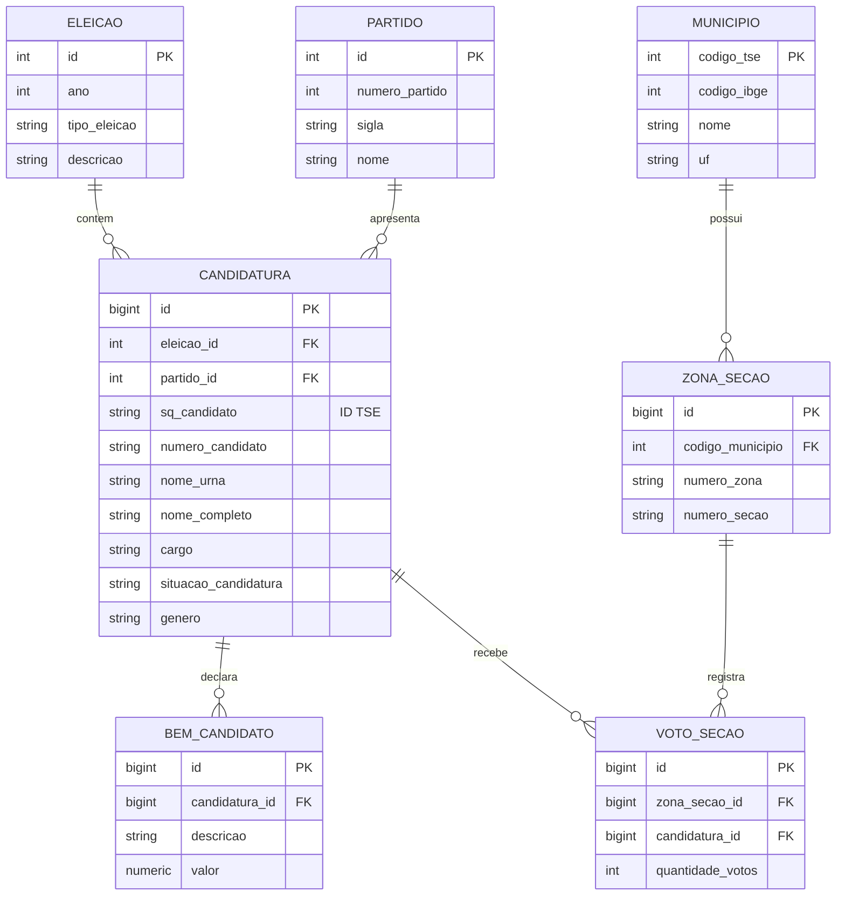
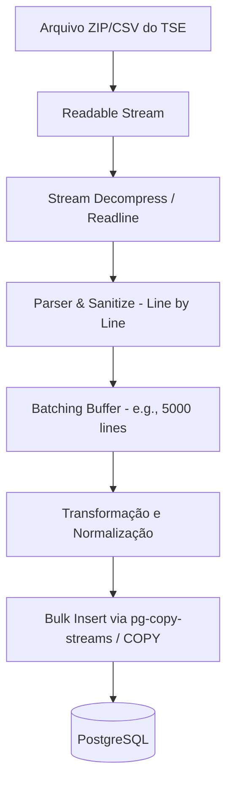
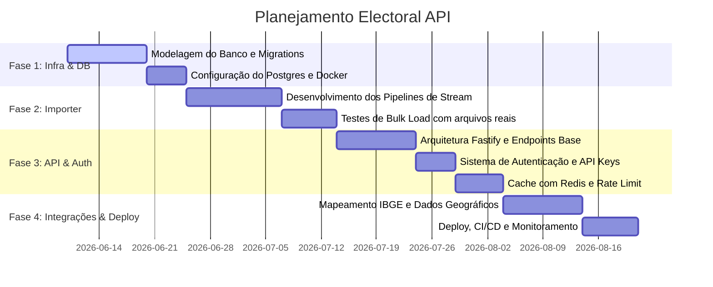

# INSYSTENS Electoral API - Documento de Arquitetura

Este documento apresenta a proposta de arquitetura completa para a **INSYSTENS Electoral API**, uma plataforma independente de inteligência eleitoral desenvolvida para importar, armazenar e disponibilizar dados públicos do Tribunal Superior Eleitoral (TSE) de forma performática e escalável.

---

## 1. Estrutura de Diretórios Recomendada

Para garantir a separação de responsabilidades (Importação, API e Banco) e facilitar a manutenção e evolução do projeto, propomos uma estrutura monorepo baseada em subprojetos ou uma estrutura modular altamente coesa:

```text
electoral-api/
├── apps/
│   ├── api/                  # Aplicação da API REST (Express/Fastify)
│   │   ├── src/
│   │   │   ├── controllers/  # Manipuladores de rotas
│   │   │   ├── middlewares/  # Autenticação, Rate Limit, Logs
│   │   │   ├── routes/       # Definição de rotas (v1, v2)
│   │   │   ├── services/     # Regras de negócio da API
│   │   │   ├── app.ts        # Inicialização do app
│   │   │   └── server.ts     # Entrada do servidor da API
│   │   ├── tsconfig.json
│   │   └── package.json
│   │
│   └── importer/             # Serviço CLI/Job worker de importação de CSVs
│       ├── src/
│       │   ├── loaders/      # Stream downloaders e gerenciadores de arquivos
│       │   ├── parsers/      # Parsers específicos por tipo de CSV do TSE
│       │   ├── pipelines/    # Pipelines de Stream (Transform & Load)
│       │   ├── index.ts      # Ponto de entrada do importador
│       │   └── config.ts     # Configurações do importador
│       ├── tsconfig.json
│       └── package.json
│
├── packages/                 # Módulos compartilhados
│   ├── database/             # Conexões, Migrations e Models do Prisma/PgPool
│   │   ├── prisma/           # Schema do Prisma e migrations
│   │   ├── src/
│   │   │   └── index.ts      # Exportação do client e utilitários
│   │   └── package.json
│   │
│   └── common/               # Utilitários, Tipagens e DTOs globais
│       ├── src/
│       └── package.json
│
├── docker/                   # Arquivos de infraestrutura local e Dockerfiles
│   ├── postgres/             # Scripts de inicialização e tuning do PG
│   └── docker-compose.yml
│
├── README.md
├── package.json              # Workspace root configuration
└── turbo.json                # Gerenciador de monorepo (opcional, para build rápido)
```

---

## 2. Stack Tecnológica Sugerida

A stack foi selecionada visando máxima performance no consumo de recursos, segurança e tipagem estática robusta:

- **Runtime & Linguagem**: Node.js (v20+ LTS) com TypeScript.
- **API Framework**: **Fastify** (ou Express). *Fastify* é recomendado pelo seu altíssimo throughput, baixo overhead e suporte nativo a esquemas JSON (ajuda na validação e serialização ultrarrápida).
- **Banco de Dados**: **PostgreSQL (v16+)** rodando em infraestrutura dedicada ou escalável com otimizações para leitura (índices, partições).
- **ORM & Query Builder**: **Prisma** para gerenciamento de migrações e modelagem, combinado com **pg-promise** ou consultas brutas via **pg-pool** para as operações de importação em lote (Bulk Insert) que exigem máxima performance.
- **Processamento de Streams**: API nativa de streams do Node.js (`stream`, `readline`), com bibliotecas auxiliares como `csv-parser` ou `fast-csv` e `pg-copy-streams` para carregamento direto no banco.
- **Cache**: **Redis** para cacheamento de endpoints altamente solicitados (como candidatos, estatísticas de votação por zona).
- **Infraestrutura e Conteinerização**: Docker e Docker Compose para desenvolvimento e deploy padronizados.

---

## 3. Estrutura da API

A API seguirá os princípios RESTful, com retorno em JSON e documentação via OpenAPI (Swagger).

### Convenções Globais
- Prefixo das rotas: `/api/v1/`
- Retornos padronizados com suporte a paginação cursor-based para coleções de dados gigantescas.

### Principais Endpoints Propostos

#### Módulo de Candidatos e Eleições
- `GET /api/v1/candidatos` - Listar e filtrar candidatos (por ano, cargo, partido, estado).
- `GET /api/v1/candidatos/:id` - Detalhes de um candidato (histórico, bens declarados, candidaturas passadas).
- `GET /api/v1/candidatos/:id/bens` - Declaração de bens do candidato.

#### Módulo de Resultados e Votação
- `GET /api/v1/resultados/totalizacao` - Resultados gerais por eleição, cargo e localidade.
- `GET /api/v1/resultados/boletim-urna` - Dados agregados por zona e seção eleitoral.

#### Módulo de Divisão Territorial e Demografia (IBGE / CEP / Mapas)
- `GET /api/v1/localidades/estados` - Listar estados e dados demográficos agregados.
- `GET /api/v1/localidades/municipios` - Listar municípios integrados com código IBGE e TSE.
- `GET /api/v1/localidades/zonas` - Zonas e seções eleitorais associadas.

#### Módulo Administrativo e Integração
- `POST /api/v1/admin/imports` - Trigger ou status do pipeline de importação.
- `GET /api/v1/health` - Health check detalhado (Banco, Redis, Importer).

---

## 4. Estrutura do Banco PostgreSQL

Para acomodar milhões de registros mantendo respostas sub-segundo na API, a modelagem foca em integridade referencial, particionamento e índices cirúrgicos.

### Principais Tabelas e Relacionamentos



### Otimizações Críticas no Postgres
1. **Particionamento de Tabelas**: Particionar tabelas de votação (`votos_secoes`) por ano da eleição e/ou unidade federativa (UF). Isso reduz drasticamente o escopo de busca de queries gigantescas.
2. **Índices Estratégicos**:
   - Índices compostos em colunas frequentemente filtradas juntas (ex: `eleicao_id` + `cargo` + `uf`).
   - Índices GIN/GiST para buscas textuais (nomes de candidatos, partidos).
   - Índices parciais para candidatos ativos/eleitos para acelerar buscas comuns.
3. **Tabelas de Agregação (Materialized Views)**: Armazenar totais por município/zona calculados previamente para evitar varrer milhões de linhas de votos em tempo real a cada requisição.

---

## 5. Estratégia para Importação de CSVs Gigantes (Stream Processing)

Arquivos do TSE podem facilmente ultrapassar 10 GB (especialmente boletins de urna e detalhes de votação). A estratégia consiste em **nunca carregar o arquivo inteiro na memória**.



### Mecanismo de Importação
1. **Download & Stream**: O arquivo é lido diretamente de um storage local ou bucket S3 via `fs.createReadStream`.
2. **Parser Eficiente**: Utilização da biblioteca `csv-parser` configurada com buffers limitados de memória para extrair registros em formato de fluxo de dados.
3. **Pipeline de Transformação**: Criação de uma `Transform` stream em Node.js para normalizar strings (e.g., converter codificação ISO-8859-1 para UTF-8, tratar datas e valores vazios).
4. **Carga em Lote (Bulk Load)**:
   - Uso da instrução `COPY` do PostgreSQL via `pg-copy-streams`. O comando `COPY` é ordens de grandeza mais rápido do que múltiplos `INSERT`s ou `Promise.all` com ORM.
   - Alternativamente, agrupamento em blocos (batches) de 5.000 a 10.000 registros executando `INSERT INTO ... VALUES ... ON CONFLICT DO NOTHING` para garantir idempotência.
5. **Controle de Backpressure**: Implementação cuidadosa de pausas na leitura do stream (`stream.pause()`) caso o banco de dados esteja lento para processar o lote atual, retomando (`stream.resume()`) quando o buffer for esvaziado.

---

## 6. Estratégia para Autenticação

Para garantir a integração segura com o **MANDATOPRO** e clientes externos, a plataforma usará uma arquitetura de autenticação híbrida:

1. **API Keys para Integrações Server-to-Server (MANDATOPRO e parceiros)**:
   - Cada cliente cadastrado recebe um par de chaves (`client_id` e `client_secret` ou um `x-api-key`).
   - Essas chaves são armazenadas no banco de dados usando hashing seguro (SHA-256).
   - Validadas em nível de middleware rápido na API.
2. **Tokens JWT (JSON Web Tokens) para Aplicações Client-side**:
   - Caso painéis ou frontends acessem diretamente a API, tokens de curta duração (15 minutos) gerados após autenticação com API Key ou credenciais.
3. **Rate Limiting**:
   - Implementação de limites de requisições por API Key usando Redis (Token Bucket Algorithm) para evitar sobrecarga e ataques de negação de serviço.

---

## 7. Estratégia de Versionamento da API

Garantir retrocompatibilidade à medida que novas eleições e recursos forem adicionados:

1. **Versionamento na URL**: Uso explícito de `/api/v1/`, `/api/v2/`.
2. **Ciclo de Depreciação (Sunset)**:
   - Quando uma nova versão for lançada, a versão anterior é marcada como depreciada incluindo o header `Sunset` e `Deprecation` nas respostas HTTP.
   - Manutenção de suporte garantido por pelo menos 12 meses antes da desativação de uma versão antiga.
3. **Versionamento Semântico no Banco de Dados**: A evolução das tabelas e esquemas de dados não deve quebrar campos existentes. Novas tabelas ou colunas devem aceitar valores nulos ou ter valores padrões para preservar a API antiga.

---

## 8. Estratégia de Logs

Monitorar o comportamento da API e da importação em tempo real sem degradar a performance:

1. **Logger de Alta Performance**: Utilização da biblioteca **Pino** no Fastify, que possui escrita assíncrona extremamente veloz.
2. **Níveis de Logs**:
   - `FATAL/ERROR`: Problemas graves no banco ou falhas críticas no importador de CSV.
   - `WARN`: Lentidão detectada ou falhas de autenticação recorrentes.
   - `INFO`: Início e fim de pipelines de importação, e métricas de requisições.
   - `DEBUG`: Logs detalhados do fluxo de streams (ativo apenas em ambiente de desenvolvimento).
3. **Centralização de Logs**: Em produção, envio dos logs estruturados em formato JSON para um agregador centralizado (como Elasticsearch/Logstash/Kibana - Elastic Stack, Grafana Loki ou Datadog) para indexação e alertas automáticos.

---

## 9. Estratégia de Backups

Segurança e resiliência dos dados eleitorais importados e dados operacionais de clientes da API:

1. **Classificação dos Dados**:
   - *Dados Públicos do TSE*: Facilmente recuperáveis via reimportação (importante guardar os scripts e raw files).
   - *Dados Operacionais (Clientes, API Keys, Logs de Auditoria)*: Críticos, necessitam de políticas rigorosas de backup.
2. **Política de Backup Automatizado (Postgres)**:
   - **Backup Lógico (`pg_dump`)**: Executado diariamente à noite para dados operacionais e tabelas menores, enviado diretamente para storage em nuvem criptografado (S3) com retenção de 30 dias.
   - **Backup Físico (WAL-G ou Barman)**: Replicação contínua dos Write-Ahead Logs (WAL) para recuperação Point-in-Time (PITR) para o banco de produção.
3. **Ambiente de Recuperação (Disaster Recovery)**: Teste periódico de restauração de backups em ambiente de staging a cada 6 meses.

---

## 10. Roadmap e Fases de Implementação

A entrega do projeto está dividida em 4 fases sequenciais e lógicas:



### Fase 1: Fundação do Banco de Dados e Infraestrutura
- Modelagem detalhada das entidades do banco no Prisma.
- Configuração do PostgreSQL (tuning de memória, buffers de escrita para cargas massivas).
- Definição do monorepo e infraestrutura Docker inicial.

### Fase 2: Core do Importer (Processamento de Dados)
- Criação do serviço de importação via Streams.
- Mapeamento e parser de arquivos críticos do TSE (Candidatos, Bens e Resultados de Votos).
- Implementação da carga em lote (Bulk Insert) com controle de Backpressure.
- Verificação de tempos de processamento e concorrência no banco de dados.

### Fase 3: Desenvolvimento da API e Autenticação
- Implementação do servidor Fastify/TypeScript com rotas de API Versionadas.
- Middleware de Autenticação com chaves de API e controle de Rate Limiting via Redis.
- Mecanismos de paginação e filtros performáticos para consultas de candidatos e resultados.
- Configuração do sistema de Logging estruturado (Pino).

### Fase 4: Integrações Adicionais, Otimização e Deploy
- Integração de dados de CEPs e códigos IBGE para permitir consultas por limites territoriais e mapas futuros.
- Criação de views materializadas para aceleração dos dashboards de votação.
- Configuração de pipelines de CI/CD para deploy seguro.
- Ativação de backups automatizados e ferramentas de monitoramento.
